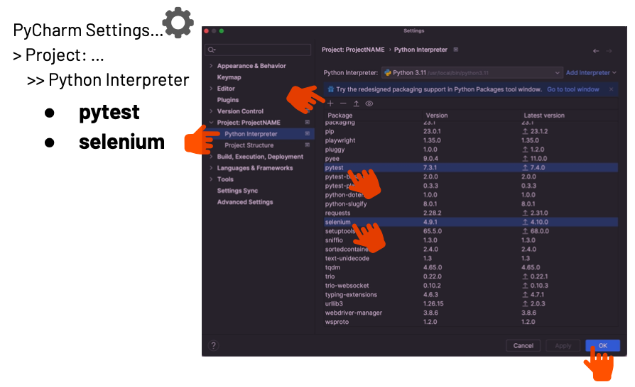

# Automated Test Lab 🧪 | Selenium + Python + Page Objects Model

This project aims to provide test automation artifacts in the end-to-end layer using the Python language and Selenium, Page Objects model.

## ☑️ You must have:

To execute the project you must have:

- [Git](https://git-scm.com/)
- [PyCharm Community Edition](https://www.jetbrains.com/pycharm/download/?section=mac)
- [Python 3+](https://www.python.org/downloads/)
- [Selenium](https://www.selenium.dev/documentation/)

## 📁 Directory structure

Using the Page Objects design pattern, which aims to separate elements into different files based on the pages on which they appear. And so, writing all the specific elements and methods of that page in your file, which is a class, and using them directly in the test scripts. We have the following directory structure in the project:

- *pages/* - contains files with test scenarios.

- *tests/* - contains the step-by-step execution scripts for the tests described in the pages.

## 🚀 Running the project:

- Clone the repository:

```bash
  $ git clone git@github.com:Automated-Test-Lab/selenium-python-pom.git
```

- Install Python (pip):



- Run tests:

```bash
  $ pytest
```

## 🛠️  Technologies

- [Python 3+](https://www.python.org/downloads/)
- [Selenium](https://www.selenium.dev/documentation/)


## 📫 Contributing

To contribute to the project, follow these steps:

    1. Clone this repositoy
    2. Create a branch: git checkout -b <nome_branch>.
    3. Make your changes and commit them: git commit -m '<mensagem_commit>'
    4. Push to branch: git push origin <nome_branch>
    5. Create the merge request.